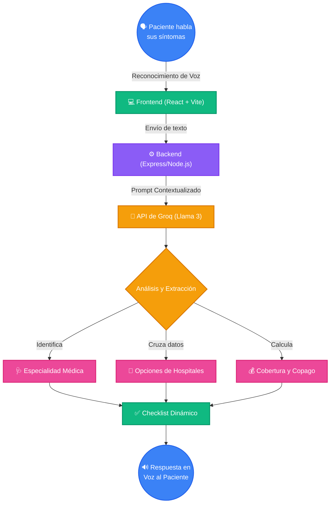

<div align="center">
  <h1>🏥 Estimador Agéntico de Copago y Cobertura Médica</h1>
  <p><i>Asistente inteligente con IA y voz para empoderar a los pacientes con transparencia médica.</i></p>
</div>

<hr/>

Este proyecto es un asistente interactivo diseñado para ayudar a los pacientes a entender los beneficios de su seguro y cuánto pagarán por su atención médica **antes** de agendar una cita. Utilizando Inteligencia Artificial y una interfaz conversacional, el sistema elimina la incertidumbre financiera en la salud.

## ✨ Características Principales

- 🎙️ **Interacción por Voz:** Interfaz amigable que permite a los pacientes hablar de sus síntomas utilizando el micrófono, ideal para adultos mayores o usuarios menos familiarizados con la tecnología.
- 🤖 **Análisis de Síntomas con IA:** El asistente entiende los malestares del paciente y recomienda la especialidad médica más adecuada.
- 🛡️ **Simulación de Cobertura:** Cruza información con planes de seguro médico (IESS, aseguradoras privadas).
- 🏥 **Comparativa de Opciones:** Sugiere diferentes hospitales o clínicas, mostrando el porcentaje de cobertura y un estimado del copago en dólares.
- ✅ **Checklist Visual Dinámico:** Genera una lista en pantalla con los datos clave extraídos de la conversación (Especialidad, Mejor opción y Copago).

---

## 🗺️ Flujo de Trabajo

A continuación se muestra cómo viaja la información desde que el usuario habla hasta que recibe su respuesta:



---

## 🛠️ Tecnologías Utilizadas

| Categoría | Tecnologías |
| :--- | :--- |
| **Frontend** | React, Vite, Tailwind CSS, Framer Motion, Lucide React |
| **Backend** | Node.js, Express, dotenv, cors |
| **Inteligencia Artificial** | Groq SDK (Modelo `llama-3.3-70b-versatile`) |
| **Integraciones Nativas** | Web Speech API (Síntesis y Reconocimiento de Voz) |

---

## 🚀 Cómo ejecutar el proyecto localmente

1. **Clona el repositorio** y entra a la carpeta del proyecto.
2. **Instala las dependencias** necesarias:
   ```bash
   npm install
   ```
3. **Configura tus variables de entorno:**
   Crea un archivo `.env` en la raíz del proyecto e incluye tu llave de Groq:
   ```env
   GROQ_API_KEY=tu_api_key_aqui
   PORT=3001
   ```
4. **Inicia el proyecto (Frontend + Backend concurrentemente):**
   ```bash
   npm run dev
   ```
5. **Abre la aplicación:**
   Navega a [http://localhost:5173/](http://localhost:5173/) en tu navegador preferido.

---

## 👥 Colaboradores

- 📧 darlyfariasmendoza@gmail.com
- 📧 fariasp2@unemi.edu.ec
- 📧 odat2017@hotmail.com
